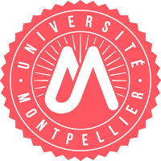

| QBIO MASTER PROGRAM| Quantitative biology in practice |
| ------------------------------------------------------------ | ---------------------------------------------- |
|  |  |

*At the  crossroads of Biology, Physics, Chemistry and Informatics, qbio is the  master program destined for students interested in studying Biology with a quantitative perspective founded on transdisciplinary approaches.*

Based at the Faculty of Sciences of the [University of Montpellier](https://www.umontpellier.fr), qbio MSc is part of the [BioHealth Master’s Degree](https://masterbs.edu.umontpellier.fr), it reaches an international audience, and it is taught entirely in English.

**qbio** is centred on **hands-on practical courses and teaching by projects**, driven by outstanding researchers from Montpellier’s community.  Students will acquire advanced knowledge by performing small projects  and experiments in the field of imaging, bio engineering, bioinformatics and structural biology, integrated with mathematical and physical  modelling.

We recruit  outstanding students from various backgrounds (biology, physics,  chemistry), who will benefit from an introductory “bootcamp” tailored to their background. At the end of the MSc, the students can apply for a PhD scholarship (3 years) at [doctoral schools](https://www.umontpellier.fr/en/education/doctoral-education) of the University of Montpellier to develop a PhD project within one of the research teams available in Montpellier.

The **qbio** curriculum has been designed to be *highly innovative in pedagogical terms*. Discussions animated by the teachers, together with the observation and manipulation of *real* material and concrete difficulties will help the students to make the different subjects their own.

Students will be part of a vibrant and growing community built around them. They will have the possibility to exchange with local and international  researchers during their projects and research seminars, but also profit from a group retreat each year, have the possibility to organise a  conference and obtain scholarship for a paid internship. Furthermore,  students will have the possibility to integrate the iGEM team of the  University of Montpellier to take part in this [international student competition](https://igem.org/Competition).

